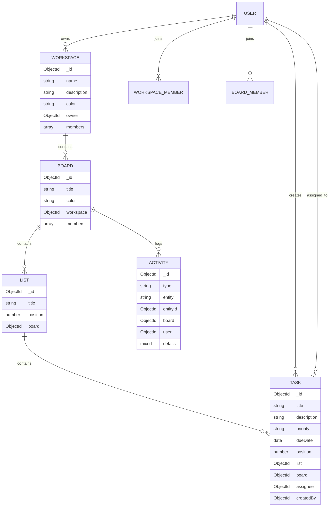

# Real-Time Task Collaboration Platform


## Table of Contents
- [1. Introduction](#1-introduction)
- [2. Features](#2-features)
- [3. Tech Stack](#3-tech-stack)
- [4. Architecture Overview](#4-architecture-overview)
- [5. Project Structure](#5-project-structure)
- [6. Database Schema Diagram](#6-database-schema-diagram)
- [7. API Documentation](#7-api-documentation)
- [8. Socket Events](#8-socket-events)
- [9. Real-Time Sync Strategy](#9-real-time-sync-strategy)
- [10. Scalability Considerations](#10-scalability-considerations)
- [11. Assumptions and Trade-offs](#11-assumptions-and-trade-offs)
- [12. Prerequisites](#12-prerequisites)
- [13. Environment Variables](#13-environment-variables)
- [14. Installation](#14-installation)
- [15. Run Locally](#15-run-locally)
- [16. Testing](#16-testing)
- [17. Build for Production](#17-build-for-production)
- [18. Usage Flow](#18-usage-flow)
- [19. Security Notes](#19-security-notes)
- [20. Recruiter Notes](#20-recruiter-notes)

## 1. Introduction
TaskFlow is a real-time collaborative project management app where teams organize work inside workspaces, boards, lists, and tasks.  
It supports live updates (Socket.IO), role-based workspace membership, task assignment, activity logs, and a responsive React UI.

## 2. Features
- JWT authentication (`signup`, `login`, `me`) with protected frontend routes.
- Workspaces with owner/admin/member roles.
- Workspace member management (invite by email, role change, remove member).
- Boards inside a workspace with color selection.
- Lists inside boards (create, rename, delete, reorder support in API).
- Tasks with drag-and-drop movement across lists.
- Task fields: title, description, assignee, priority, due date.
- Activity feed API for board-level changes.
- Search API across boards and tasks in a workspace.
- Real-time updates for:
  - task moved
  - task updated
  - list created/updated/deleted
  - board created (workspace room broadcast)
- Light/dark theme support.
- Vitest + Testing Library test setup for key realtime flows.

## 3. Tech Stack
### Frontend
- React 18
- Vite
- React Router
- Tailwind CSS
- Socket.IO Client
- Framer Motion
- `@hello-pangea/dnd` for drag-and-drop
- Axios
- Vitest + Testing Library

### Backend
- Node.js + Express
- MongoDB + Mongoose
- Socket.IO
- JWT (`jsonwebtoken`)
- bcrypt
- cookie-parser
- CORS
- Nodemailer + Mailgen (email flows)

## 4. Architecture Overview
### Frontend architecture
- React SPA with route-level separation (`/login`, `/signup`, `/workspaces`, `/workspaces/:workspaceId/boards/:boardId`).
- Context providers for auth, workspace state, theme, and socket lifecycle.
- Service layer (`frontend/services/*`) abstracts all API calls from UI components.
- Realtime UI updates use Socket.IO events plus optimistic local state updates.

### Backend architecture
- Express modular API with route groups (`/api/auth`, `/api/workspaces`, `/api/boards`, `/api/lists`, `/api/tasks`, `/api/search`, `/api/activities`).
- Mongoose models for domain entities and shared helper guards for membership checks.
- Socket.IO server with JWT-authenticated connections and board/workspace rooms.
- REST endpoints remain source of truth; sockets broadcast state changes across clients.

### Data model
- `Workspace` -> has many `Board`
- `Board` -> has many `List` and `Task`
- `Task` -> belongs to one `List` and one `Board`
- `Workspace` and `Board` keep `members` with `{ user, role }`
- `Activity` stores board-level event history

### Auth model
- Frontend stores token in `localStorage` (`taskflow_token`) and sends it as `Authorization: Bearer <token>`.
- Backend API middleware accepts bearer token (and cookie fallback in some paths).
- Socket connection uses JWT in `socket.handshake.auth.token`.

### Realtime model
- Board-scoped events use room `board-<boardId>`.
- Workspace-scoped board creation uses room `workspace-<workspaceId>`.
- Client emits events; server validates/broadcasts to relevant rooms.

## 5. Project Structure
```text
backend/
  src/
    controllers/
    middlewares/
    models/
    routes/
    utils/
    socket.handlers.js
    app.js
    index.js

frontend/
  src/
    pages/
    components/
    context/
  services/
  lib/
  tests/
```

## 6. Database Schema Diagram


### Schema Design (Collections, Fields, Relations, Indexes)
#### `users`
- `_id: ObjectId`
- `username: String` (unique, indexed)
- `email: String` (unique)
- `fullName: String`
- `password: String` (hashed)
- `avatar: { url, localPath }`
- `isEmailVerified: Boolean`
- `refreshToken: String`
- `forgotPasswordToken: String`
- `forgotPasswordExpiry: Date`
- `emailVerificationToken: String`
- `emailVerificationExpiry: Date`
- `createdAt, updatedAt`

#### `workspaces`
- `_id: ObjectId`
- `name: String`
- `description: String`
- `color: String`
- `owner: ObjectId -> users._id`
- `members: [{ user: ObjectId -> users._id, role: \"admin\" | \"member\" }]`
- `createdAt, updatedAt`
- Membership checks primarily use `members.user`.

#### `boards`
- `_id: ObjectId`
- `title: String`
- `workspace: ObjectId -> workspaces._id` (indexed)
- `color: String`
- `members: [{ user: ObjectId -> users._id, role: \"admin\" | \"member\" }]`
- `createdAt, updatedAt`

#### `lists`
- `_id: ObjectId`
- `title: String`
- `board: ObjectId -> boards._id` (indexed)
- `position: Number` (indexed)
- `createdAt, updatedAt`

#### `tasks`
- `_id: ObjectId`
- `title: String`
- `description: String`
- `list: ObjectId -> lists._id` (indexed)
- `board: ObjectId -> boards._id` (indexed)
- `position: Number` (indexed)
- `assignee: ObjectId -> users._id | null`
- `priority: \"low\" | \"medium\" | \"high\" | \"urgent\"`
- `dueDate: Date | null`
- `createdBy: ObjectId -> users._id`
- `createdAt, updatedAt`
- Text index for search: `{ title: \"text\", description: \"text\" }`

#### `activities`
- `_id: ObjectId`
- `type: \"created\" | \"updated\" | \"moved\" | \"deleted\" | \"assigned\"`
- `entity: \"board\" | \"list\" | \"task\"`
- `entityId: ObjectId`
- `board: ObjectId -> boards._id` (indexed)
- `user: ObjectId -> users._id`
- `details: Mixed`
- `createdAt, updatedAt`

### Relationship Rules
- A workspace contains many boards.
- A board contains many lists and tasks.
- A list belongs to one board.
- A task belongs to one board and one list.
- A task assignee must be a valid board member.
- Activity entries are recorded per board-level action.

## 7. API Documentation
### Auth
- `POST /api/auth/signup` - create user and return JWT + profile.
- `POST /api/auth/login` - authenticate and return JWT + profile.
- `GET /api/auth/me` - fetch currently authenticated user.

### Workspaces
- `GET /api/workspaces` - list workspaces for authenticated user.
- `GET /api/workspaces/:id` - workspace detail + `membersData`.
- `POST /api/workspaces` - create workspace.
- `PUT /api/workspaces/:id` - update workspace metadata.
- `DELETE /api/workspaces/:id` - delete workspace and descendants.
- `POST /api/workspaces/:wsId/members` - invite member by email.
- `DELETE /api/workspaces/:wsId/members/:userId` - remove member.
- `PATCH /api/workspaces/:wsId/members/:userId/role` - change role.

### Boards
- `GET /api/boards?workspace=<workspaceId>` - list boards in workspace.
- `GET /api/boards/:id` - board detail + lists + tasks + `membersData`.
- `POST /api/boards` - create board.
- `PUT /api/boards/:id` - update title/color.
- `DELETE /api/boards/:id` - delete board and descendants.

### Lists
- `POST /api/lists` - create list.
- `PUT /api/lists/:id` - update title/position.
- `DELETE /api/lists/:id` - delete list and its tasks.
- `PATCH /api/lists/reorder` - reorder lists by position.

### Tasks
- `GET /api/tasks?board=<boardId>` - list board tasks.
- `POST /api/tasks` - create task.
- `PUT /api/tasks/:id` - update task fields.
- `DELETE /api/tasks/:id` - delete task.
- `PATCH /api/tasks/:id/move` - move task to another list and position.
- `PATCH /api/tasks/:id/assign` - assign/unassign task member.

### Search and Activity
- `GET /api/search?q=<query>&workspace=<workspaceId>` - search tasks/boards.
- `GET /api/activities?boardId=<boardId>&page=1&limit=20` - paginated activity feed.

### API Summary (Quick Reference)
### Auth
- `POST /api/auth/signup`
- `POST /api/auth/login`
- `GET /api/auth/me`

### Workspaces
- `GET /api/workspaces`
- `GET /api/workspaces/:id`
- `POST /api/workspaces`
- `PUT /api/workspaces/:id`
- `DELETE /api/workspaces/:id`
- `POST /api/workspaces/:wsId/members`
- `DELETE /api/workspaces/:wsId/members/:userId`
- `PATCH /api/workspaces/:wsId/members/:userId/role`

### Boards
- `GET /api/boards?workspace=<workspaceId>`
- `GET /api/boards/:id`
- `POST /api/boards`
- `PUT /api/boards/:id`
- `DELETE /api/boards/:id`

### Lists
- `POST /api/lists`
- `PUT /api/lists/:id`
- `DELETE /api/lists/:id`
- `PATCH /api/lists/reorder`

### Tasks
- `GET /api/tasks?board=<boardId>`
- `POST /api/tasks`
- `PUT /api/tasks/:id`
- `DELETE /api/tasks/:id`
- `PATCH /api/tasks/:id/move`
- `PATCH /api/tasks/:id/assign`

### Search and Activity
- `GET /api/search?q=<query>&workspace=<workspaceId>`
- `GET /api/activities?boardId=<boardId>&page=1&limit=20`

## 8. Socket Events
### Client emits
- `join-board`, `leave-board`
- `join-workspace`, `leave-workspace`
- `task-moved`, `task-updated`, `task-deleted`
- `list-created`, `list-updated`, `list-deleted`
- `board-created`

### Server broadcasts
- `task-moved`, `task-updated`
- `list-created`, `list-updated`, `list-deleted`
- `board-created`
- `user-joined`, `user-left` (board presence)

## 9. Real-Time Sync Strategy
- Client joins board rooms (`join-board`) and workspace rooms (`join-workspace`) after auth socket connect.
- Mutations are persisted via REST first; frontend emits socket event after successful API response.
- Server validates event payload and broadcasts to other clients in target room (`socket.to(room).emit(...)`).
- Receivers update local state with idempotent upsert/delete logic to avoid duplicates.
- Covered live flows:
  - task create/update/move/delete
  - list create/update/delete
  - board create (workspace scope)

## 10. Scalability Considerations
- Room-scoped events reduce unnecessary cross-tenant broadcasts.
- API routes enforce workspace/board membership before data access.
- MongoDB indexes used on board/list/position fields and text search fields for tasks.
- Service-layer boundary on frontend simplifies future caching and pagination improvements.
- Horizontal websocket scaling can be added later via Socket.IO adapter (e.g., Redis).

## 11. Assumptions and Trade-offs
- Assumes each board belongs to one workspace and users collaborate within that boundary.
- JWT is stored in `localStorage` for simplicity; cookie-only auth can be used for stricter security.
- REST is source of truth; websocket events are state propagation, not persistence.
- Current tests emphasize realtime/service behavior; backend integration tests can be expanded further.
- Deployment targets assume frontend on Vercel and backend on Render.

## 12. Prerequisites
- Node.js 18+
- npm 9+
- MongoDB database (local or Atlas)

## 13. Environment Variables
### Backend (`backend/.env`)
```bash
MONGO_URI=<your_mongodb_uri>
PORT=3000
CORS_ORIGIN=http://localhost:5173

ACCESS_TOKEN_SECRET=<secret>
ACCESS_TOKEN_EXPIRY=10d
REFRESH_TOKEN_SECRET=<secret>
REFRESH_TOKEN_EXPIRY=10d

MAILTRAP_SMTP_HOST=<host>
MAILTRAP_SMTP_PORT=<port>
MAILTRAP_SMTP_USER=<user>
MAILTRAP_SMTP_PASS=<pass>
FORGOT_PASSWORD_REDIRECT_URL=http://localhost:5173/forgot-password
```

### Frontend (`frontend/.env`)
```bash
VITE_API_URL=http://localhost:3000/api
VITE_SOCKET_URL=http://localhost:3000
# Optional:
# VITE_USE_MOCK=true
```

## 14. Installation
```bash
# clone repo
git clone https://github.com/abhijtek/TaskFlow-Real-Time-Task-Collaboration-Platform.git
cd TaskFlow-Real-Time-Task-Collaboration-Platform

# backend
cd backend
npm install

# frontend
cd ../frontend
npm install
```

## 15. Run Locally
### Start backend
```bash
cd backend
npm run dev
```

### Start frontend
```bash
cd frontend
npm run dev
```

### App URLs
- Frontend: `http://localhost:5173`
- Backend API: `http://localhost:3000/api`

## 16. Testing
```bash
cd frontend
npm run test
npm run test:run
npm run test:coverage
```

Current tests cover key realtime and socket integration behavior around board creation and sidebar updates.

## 17. Build for Production
```bash
cd frontend
npm run build
npm run preview
```

```bash
cd backend
npm start
```

## 18. Usage Flow
1. Create an account or log in.
2. Create a workspace.
3. Invite members by email from the workspace sidebar.
4. Create a board in that workspace.
5. Use default lists or add new lists.
6. Create tasks and drag tasks between lists.
7. Open multiple clients to see realtime updates.

## 19. Security Notes
- Do not commit real `.env` secrets to source control.
- Rotate secrets immediately if they were exposed.
- Prefer `httpOnly` cookie-only auth for production if you harden this further.

## 20. Recruiter Notes
- Includes full-stack architecture (React + Node + MongoDB).
- Demonstrates realtime collaboration with room-scoped Socket.IO events.
- Includes role-based access controls and API-level membership checks.
- Includes automated frontend tests for critical realtime behavior.
